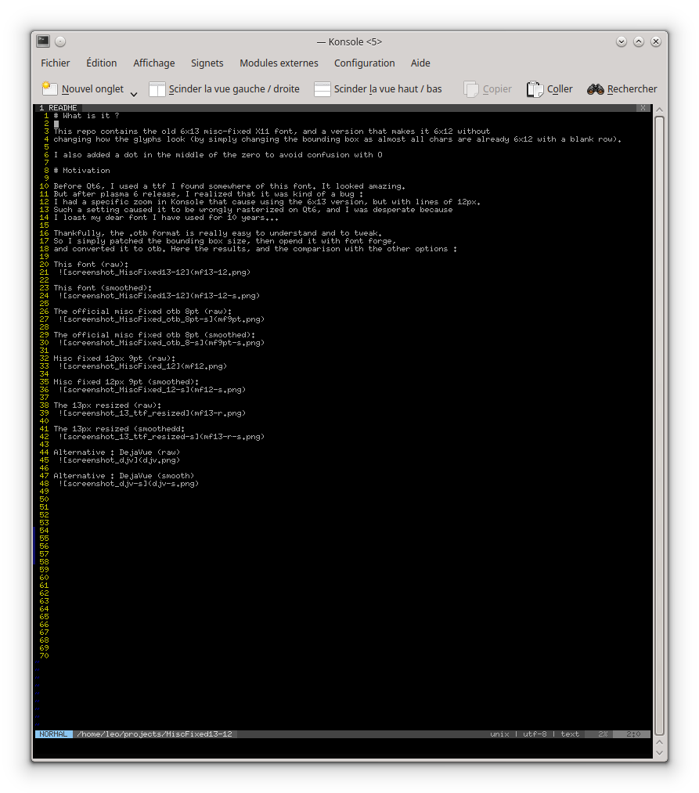
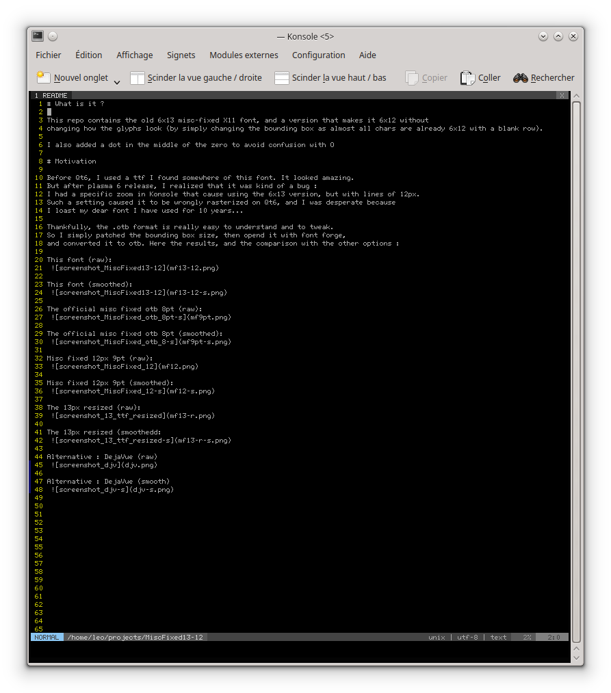
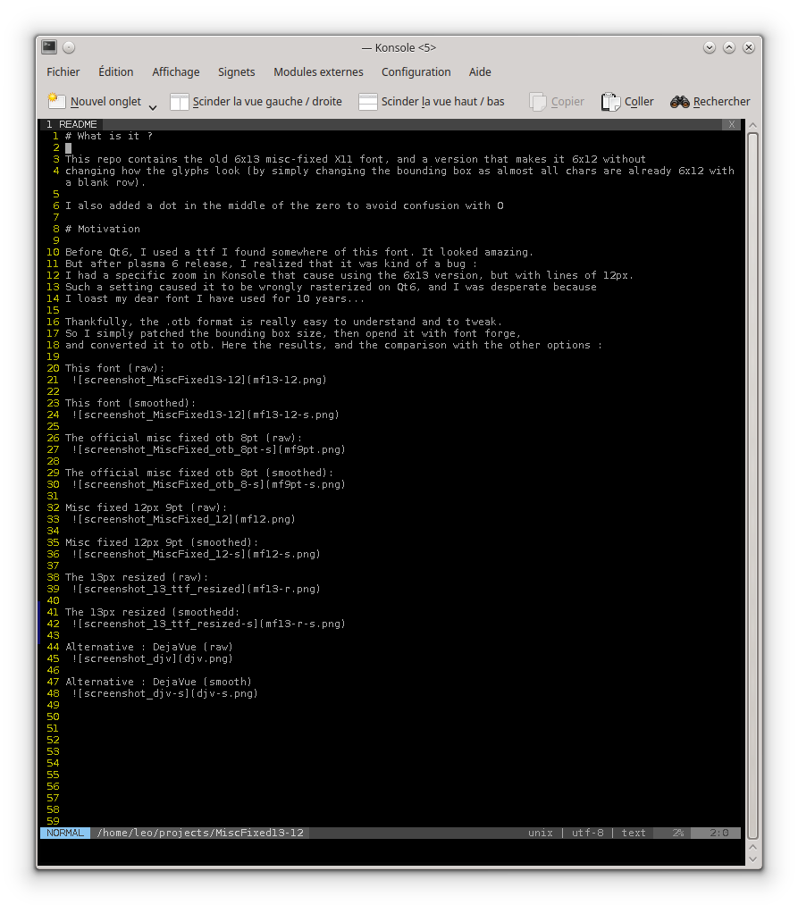

# What is it ?

This repo contains the old 6x13 misc-fixed X11 font, and a version that makes it 6x12 without
changing how the glyphs look (by simply changing the bounding box as almost all chars are already 6x12 with a blank row).

I also added a dot in the middle of the zero to avoid confusion with O

# Motivation

Before Qt6, I used a ttf I found somewhere of this font. It looked amazing.
But after plasma 6 release, I realized that it was kind of a bug :
I had a specific zoom in Konsole that cause using the 6x13 version, but with lines of 12px.
Such a setting caused it to be wrongly rasterized on Qt6, and I was desperate because
I loast my dear font I have used for 10 years...

Thankfully, the .otb format is really easy to understand and to tweak.
So I simply patched the bounding box size, then opend it with font forge,
and converted it to otb. Here the results, and the comparison with the other options :

This font (raw):
 

This font (smoothed):
 

The official misc fixed otb 8pt (raw):
 

The official misc fixed otb 8pt (smoothed):
 

Misc fixed 12px 9pt (raw):
 

Misc fixed 12px 9pt (smoothed):
 

The 13px resized (raw):
 

The 13px resized (smoothedd:
 

Alternative : DejaVue (raw)
 

Alternative : DejaVue (smooth)
 

